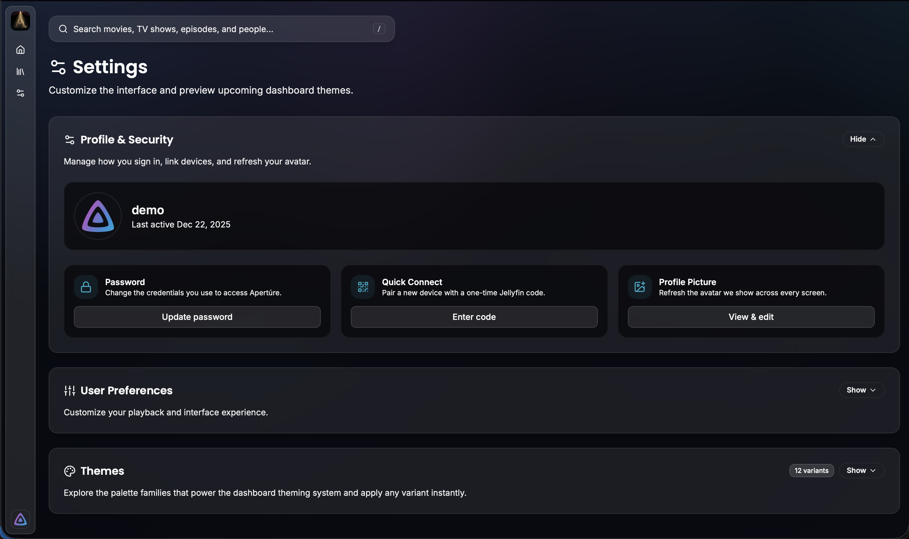

<h1 align="center">
  <br>
    <a href="https://github.com/akhilmulpurii/aperture"></a>
  <br>
  APERTÚRE
  <br>
</h1>
<h4 align="center">A Modern, Streamlined Jellyfin Client built with Next.js</h4>

https://github.com/user-attachments/assets/a35d71e2-14bf-475f-9e54-a0cf2c7bc044

<div align="center">
  <table>
    <tr>
      <td align="center">
        
      </td>
      <td align="center">
        
      </td>
    </tr>
    <tr>
      <td align="center">
        
      </td>
      <td align="center">
        
      </td>
    </tr>
    <tr>
      <td align="center">
        
      </td>
      <td align="center">
        
      </td>
    </tr>
    <tr>
      <td align="center">
        
      </td>
      <td align="center">
        
      </td>
    </tr>
  </table>
</div>

---

## ✨ Overview

**APERTÚRE** is a clean, modern Jellyfin client built with **Next.js** — designed for speed, simplicity, and elegance.  
It builds upon the solid foundation of **[Finetic](https://github.com/AyaanZaveri/finetic)** while introducing extended functionality and removing unnecessary complexity.

Special Thanks to **[@AyaanZaveri](https://github.com/AyaanZaveri)**, this is based on his work on finetic, but I am building it upon my personal preferences.

### 🔹 Core Features & History (v1.0 - v1.1)

- **Rich Media Experience** – Native support for **Video Backdrops**, **Theme Songs**, and **Trickplay** thumbnails.
- **Smart Connectivity** – **Quick Connect** login support and intelligent **Direct Play/Transcoding** selection.
- **Advanced Library Support** – Integrated support for **Collections (Box Sets)** and Live TV (WIP).
- **Theming** – Multiple theme variations including "Cinematic Theatre Black".

### 🔹 Version 1.2.x Changes (New)

_This milestone serves as a major foundational update, focusing on essential playback improvements and a significantly polished user experience._

- **Redesigned Playback Engine** – A seamless, rebuilt playback subsystem aligned with Jellyfin best practices for reliable and smooth streaming.
- **Hero Media Bar** – A new, visually striking "Hero" section at the top of the interface to showcase your highlighted content.
- **Smart Episodic Features** – Native support for **Intro and Outro skipping** to make binge-watching effortless (requires the [Intro Skipper plugin](https://github.com/intro-skipper/intro-skipper) on your server).
- **Improved Audio Control** – You can now easily select your preferred **Audio Stream** directly from the media details page.
- **Mini Player** – Keep watching your content while browsing the rest of your library with the new Picture-in-Picture mode.
- ~~**Better Connectivity** – Added **Local Network Discovery** and saved server preferences to make connecting (and staying connected) easier.~~ **Note: Removed this due to inaccuracy**
- **Refined Startup** – A proper **Splash Screen** now handles initialization, ensuring the app launches smoothly and efficiently every time.

---

## 🧠 Built With

- **Frontend**: Next.js, TypeScript
- **Styling**: Tailwind v4, shadcn/ui, Framer Motion
- **State Management**: Jotai
- **Media Backend**: Jellyfin Server API

---

## ⚙️ Instructions

### Local Development

1. **Install dependencies**
   ```bash
   bun install
   ```
2. **Start the Next.js dev server**
   ```bash
   bun dev
   ```
3. Visit `http://localhost:3000` and sign in with your Jellyfin instance credentials.

Hot reloading is enabled by default, so UI changes are reflected immediately.

### Production Build

Create an optimized bundle served by any static host (Vercel, Netlify, S3, etc.):

```bash
bun build
bun preview   # optional sanity check
```

The generated assets live in `dist/`. Configure your host to fall back to `index.html` for SPA routing.

### Docker

**docker-compose**

```bash
docker-compose up --build
```

The container serves the built app via the port exposed in `Dockerfile`/`docker-compose.yml`. Adjust env vars (server URL, etc.) via compose overrides or `docker run -e`.

### Public HTTP Jellyfin Servers

The hosted app at `https://aperture.vercel.app` runs over HTTPS. Modern browsers block requests from an HTTPS site to **public** HTTP endpoints for security reasons, which means remote servers such as `http://23.x.x.x:8096` cannot be reached. To use Apertúre with a public server:

1. Add HTTPS to your Jellyfin instance (Let's Encrypt, Caddy/NGINX reverse proxy, Cloudflare tunnel, etc.), or
2. Run Apertúre locally (bun dev, Docker) over HTTP.

LAN/private IPs (192.168.x.x, 10.x.x.x, etc.) generally still work over HTTP because browsers treat them as “private network” resources, but for anything exposed to the internet you’ll need HTTPS.
