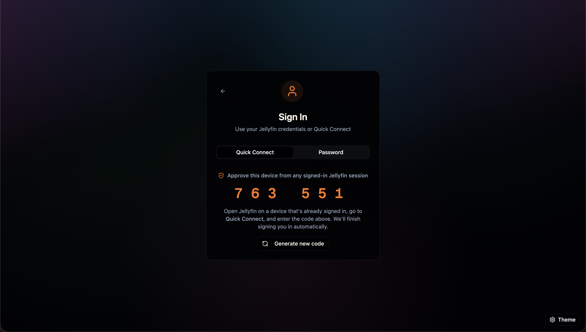

<h1 align="center">
  <br>
    <a href="https://github.com/akhilmulpurii/aperture"></a>
  <br>
  APERTÚRE
  <br>
</h1>
<h4 align="center">A Modern, Streamlined Jellyfin Client built with Vite+React+Tauri</h4>

https://github.com/user-attachments/assets/ebd8c289-658d-471d-98d3-c7fb3ae51d8e

https://github.com/user-attachments/assets/5f536de2-de3f-4b2e-83bc-331ab88880ad

<div align="center">
  <table>
    <tr>
      <td align="center">
        
      </td>
      <td align="center">
        
      </td>
    </tr>
    <tr>
      <td align="center">
        
      </td>
      <td align="center">
        
      </td>
    </tr>
    <tr>
      <td align="center">
        
      </td>
      <td align="center">
        
      </td>
    </tr>
  </table>
</div>

---

## ✨ Overview

**APERTÚRE** is a clean, modern Jellyfin client built with **Vite+React.js** — designed for speed, simplicity, and elegance.  
It builds upon the solid foundation of **[Finetic](https://github.com/AyaanZaveri/finetic)** while introducing extended functionality and removing unnecessary complexity.

Special Thanks to **[@AyaanZaveri](https://github.com/AyaanZaveri)**, this is based on his work on finetic, but I am building it upon my personal preferences.

### 🔹 What’s New in APERTÚRE

- **Simplified Experience** – Removed AI dependencies for a faster, lighter client, as I personally would not use them at all.
- **Migrated to Vite** - The Entire Project is migrated into Vite + React, since Vite is much faster than webpack and we dont really need SSR features for an application like this.
- **Collections Support** – Full integration for browsing and playing box sets
- **Live TV (WIP)** – Live TV currently works partially, Channels populate but a guide and programs page must be integrated.
- **Improved Navigation & Performance** – Cleaner architecture and optimized loading
- **Using Tauri instead of Electron** – Now native apps will be based on tauri for better performance, especially with Vite + React + Tauri

**🔹Version 1.1.x Changes🔹**

- **Quick Connect** – Now supports quick connect option, this is the default way to login, password login can still be used.
- **Now Supports Direct Play** – Now the urls can be played by both transcoding as well as direct streaming.
- **Theme Songs Playback** – Now when browsing the tv show/movie detail page, will play the theme song whenever available.
- **Video Backdrops/Theme Videos** – Now when browsing the tv show/movie detail page, whenever a theme video is available, it will be used as the video backdrop instead of the static backdrop image, theme video takes precedence over theme music, hence theme music is disabled on items where theme video is available.
- **Theming Enhancements** – Various theming variations have been added apart from the default light/dark mode (My personal favorite is the Cinematic Theatre Black).

---

## 🧠 Built With

- **Frontend**: React, Vite, TypeScript, Tauri
- **Styling**: Tailwind v4, shadcn/ui, Framer Motion
- **State Management**: Jotai
- **Media Backend**: Jellyfin Server API

---

## ⚙️ Instructions

### Local Development

1. **Install dependencies**
   ```bash
   yarn install
   ```
2. **Start the Vite dev server**
   ```bash
   yarn dev
   ```
3. Visit `http://localhost:3000` and sign in with your Jellyfin instance credentials.

Hot reloading is enabled by default, so UI changes are reflected immediately.

### Production Build

Create an optimized bundle served by any static host (Vercel, Netlify, S3, etc.):

```bash
yarn build
yarn preview   # optional sanity check
```

The generated assets live in `dist/`. Configure your host to fall back to `index.html` for SPA routing.

### Docker

1. **Local build & run**
   ```bash
   docker build -t aperture:latest .
   docker run -p 4173:4173 aperture:latest
   ```
2. **docker-compose**
   ```bash
   docker-compose up --build
   ```

The container serves the built app via the port exposed in `Dockerfile`/`docker-compose.yml`. Adjust env vars (server URL, etc.) via compose overrides or `docker run -e`.

### Tauri Builds (Early Preview)

Tauri desktop bundles can be generated with:

```bash
yarn tauri build
```

> **Note:** Native builds (tauri) are **not actively supported** right now. The priority is delivering the best possible web experience first. Feel free to experiment and report issues, but expect slower turnaround on desktop-specific bugs until native support resumes.

### Public HTTP Jellyfin Servers

The hosted app at `https://aperture.vercel.app` runs over HTTPS. Modern browsers block requests from an HTTPS site to **public** HTTP endpoints for security reasons, which means remote servers such as `http://23.x.x.x:8096` cannot be reached. To use Apertúre with a public server:

1. Add HTTPS to your Jellyfin instance (Let's Encrypt, Caddy/NGINX reverse proxy, Cloudflare tunnel, etc.), or
2. Run Apertúre locally (Vite dev server, Docker, or the Tauri build) over HTTP.

LAN/private IPs (192.168.x.x, 10.x.x.x, etc.) generally still work over HTTP because browsers treat them as “private network” resources, but for anything exposed to the internet you’ll need HTTPS.
